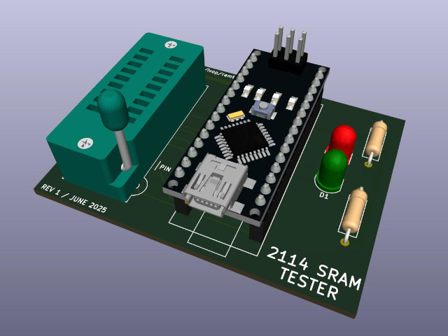
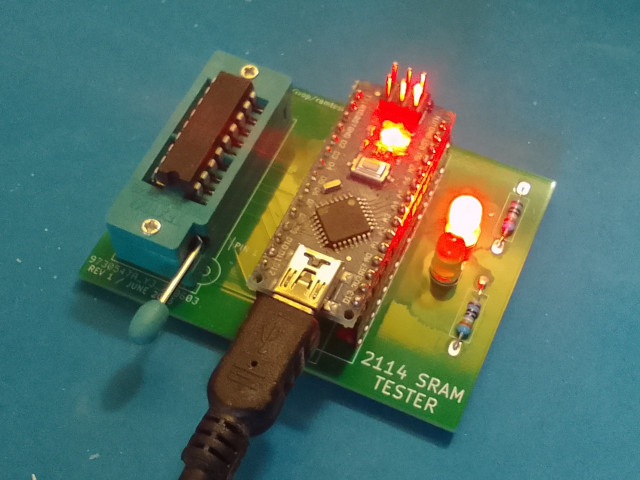

# 2114 RAM Tester

The hardware is almost identical to [this](https://github.com/gpimblott/SRAM2114_Tester) project,
but the firmware is completely different and catches a lot of errors that would otherwise go
undetected.

### Hardware

Here's how to connect the 2114 to the Arduino Nano:

</img>

Click the image for a larger version, or view the [pdf version](doc/ramtest2114.pdf).
Connect the LEDs through a 390 ohm resistor to ground.
It's important to orient the LED [the right way](https://www.switchelectronics.co.uk/blogs/news/led-polarity-basic-guide).
The plus side goes to the Nano, the negative side to the resistor to ground.
To ease testing multiple 2114s it's advised to use a ZIF socket.

### Gerbers

</img>
</img>
</img>

In the [gerbers](kicad/gerbers) directory you'll find Gerber files for a complete PCB.
They have been tested to be working correctly.

### Flashing the firmware

Download [main.hex](https://github.com/ivop/ramtest2114/raw/refs/heads/master/main.hex) and use ```avrdude``` to flash it to the Arduino Nano.

```
avrdude -V -c arduino -b 57600 -P /dev/ttyUSB0 -p atmega328p -vv -U flash:w:main.hex
````

Replace ```/dev/ttyUSB0``` if your system is configured to assign a different serial device to your Nano.

### Usage

Insert a 2114 chip into the 18 pin socket and apply power to the Nano.
After booting it'll start testing immediately.
During the test, the red and green LEDs will blink.
When it's finished, either the green LED or the red LED stays on, indicating a success or a failure respectively.
Pressing the reset button on the Nano will rerun the test.
Be sure to disconnect the power when swapping the chip for another one to test.
Having the Vcc pin make contact without the ground pin being connected could damage the chip.

If you connect the Nano to the computer while testing, you can open a serial connection.
During the test, it'll print some diagnostic information, and a message when it's finished or encountered an error.

```
2114 SRAM MARCH MSS TESTER
^(w0)
^(r0,r0,w1,w1)
^(r1,r1,w0,w0)
...
...
v(r0,r0,w1,w1)
v(r1,r1,w0,w0)
v(r0)
RAM TESTED OK!
```

### Building the firmware from source

Install ```avr-gcc```, ```avr-libc```, and ```avrdude```.
Clone this repository and type ```make```.
Type ```make flash``` to automatically flash it to the connected Arduino Nano at ```/dev/ttyUSB0```.

### Algorithm

The tester uses the MARCH MSS algorithm.
It tests all combinations of the up/down (🡙) rules, and uses a set of three different background data value pairs to cover all errors it's able to detect.

Write errors:

* (W) SAF - Stuck At Fault
* (W) TF - Transition Fault
* (W) WDF - Write Destructive Fault
* (W) CFin - Inversion Coupling Fault
* (W) CFid - Idempotent Coupling Fault
* (W) CFst - Static Coupling Fault
* (W) CFds - Disturb Cell Coupling Fault
* (W) CFtr - Transition Coupling Fault
* (W) CFwd - Write Destructive Coupling

Read errors:

* (R) IRF - Incorrect Read Fault
* (R) RDF - Read Destructive Fault
* (R) DRDF - Deceptive Read Destructive Fault
* (R) SOF - Stuck Open Fault
* (R) ADF - Address Decoder Fault
* (R) CFds - Disturb Cell Coupling Fault
* (R) CFir - Incorrect Read Coupling Fault
* (R) CFrd - Read Destructive Coupling
* (R) CFir - Incorrect Read Coupling Fault

### References

* G. Harutunyan, V. A. Vardanian, and Y. Zorian, “Minimal march tests for unlinked static faults in random access memories,”
in 23rd IEEE VLSI Test Symposium (VTS’05), 2005, pp. 53–59, doi: 10.1109/VTS.2005.56.
[sci-hub link](https://sci-hub.se/10.1109/VTS.2005.56)
* [Understanding Memory Fault Models](https://www.embedded.com/understanding-memory-fault-models/)
( [archived version](https://web.archive.org/web/20240420233156/https://www.embedded.com/understanding-memory-fault-models/) )
