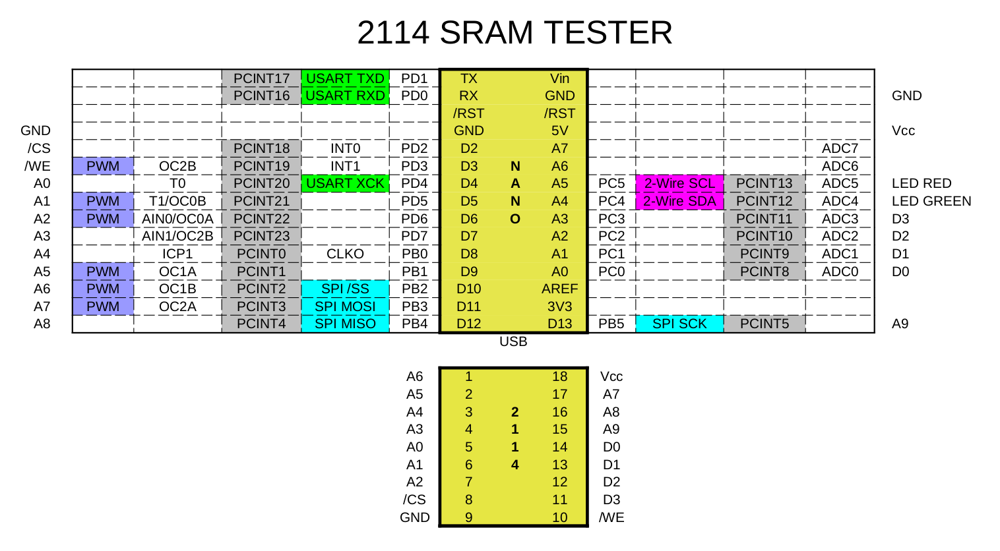

# 2114 RAM Tester

The hardware is almost identical to [this](https://github.com/gpimblott/SRAM2114_Tester) project,
but the firmware is completely different and catches a lot of errors that would otherwise go
undetected.

### Hardware

Here's how to connect the 2114 to the Arduino Nano:

</img>

Click the image for a larger version, or view the [pdf version](doc/ramtest2114.pdf).

### Software

### Errors Detected

Write errors:

* (W) SAF - Stuck At Fault
* (W) TF - Transition Fault
* (W) WDF - Write Destructive Fault
* (W) CFin - Inversion Coupling Fault
* (W) CFid - Idempotent Coupling Fault
* (W) CFst - Static Coupling Fault
* (W) CFds - Disturb Cell Coupling Fault
* (W) CFtr - Transition Coupling Fault
* (W) CFwd - Write Destructive Coupling

Read errors:

* (R) IRF - Incorrect Read Fault
* (R) RDF - Read Destructive Fault
* (R) DRDF - Deceptive Read Destructive Fault
* (R) SOF - Stuck Open Fault
* (R) ADF - Address Decoder Fault
* (R) CFds - Disturb Cell Coupling Fault
* (R) CFir - Incorrect Read Coupling Fault
* (R) CFrd - Read Destructive Coupling
* (R) CFir - Incorrect Read Coupling Fault

### References

* G. Harutunyan, V. A. Vardanian, and Y. Zorian, “Minimal march tests for unlinked static faults in random access memories,”
in 23rd IEEE VLSI Test Symposium (VTS’05), 2005, pp. 53–59, doi: 10.1109/VTS.2005.56.
[sci-hub link](https://sci-hub.se/10.1109/VTS.2005.56)
* [Understanding Memory Fault Models](https://www.embedded.com/understanding-memory-fault-models/)  
